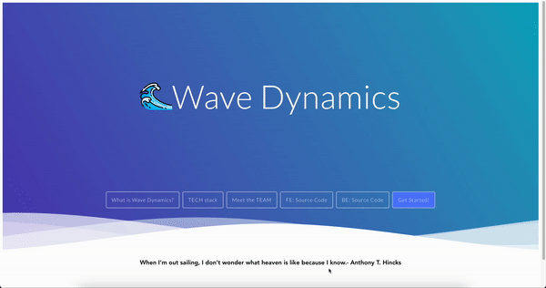
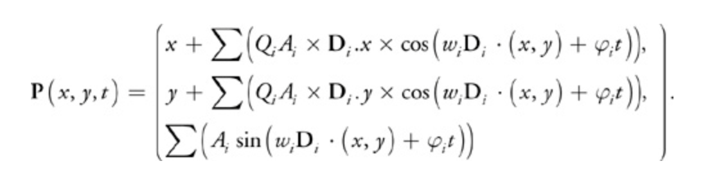

  

Presented at HACKNJIT @ NJIT 2023

<h1  align="center">Wave Dynamics</h1>

  

###

###

Made with Web GL, Three js, Vue js, JavaScript and CPP

### Product Brief:

Overview:
Wave Dynamics is a cutting-edge web application designed to simulate and visualize realistic ocean wave behaviors. Utilizing authentic real-world data, it offers a comprehensive platform for understanding, predicting, and experiencing oceanic waves in an immersive digital environment.

Key Features:

1. **Realistic Wave Simulation:** High-fidelity representation of ocean waves based on actual data, providing an authentic experience for users.

2. **Interactive Controls:** Intuitive controls enable users to manipulate wave parameters, such as height, speed, and frequency, allowing for a customizable simulation experience.

3. **Educational Tool:** Ideal for students, researchers, and educators to comprehend wave dynamics, coastal processes, and marine ecosystems through a visually engaging platform.

4. **Predictive Capabilities:** Aids in understanding and predicting wave behaviors, facilitating better decision-making for coastal planning, maritime operations, and climate change studies.

5. **Safety and Risk Assessment:** Allows assessment of risks for maritime activities, coastal infrastructure, and natural disasters, aiding in preparedness and safety measures.

6. **Engineering and Innovation:** Enables testing and development of new technologies and infrastructure for coastal regions and marine operations.

7. **Public Engagement:** Promotes awareness and interest in ocean sciences, contributing to public engagement and understanding of marine-related issues.

Target Audience:

- Researchers and oceanographers
- Educational institutions (students and educators)
- Environmental and coastal planners
- Maritime and offshore industry professionals
- Engineering and technology development sectors
- General public interested in oceanic sciences and recreation

Future Developments:

Potential future developments may include:
- Integration of AI for more accurate predictive modeling
- User-generated content sharing and collaboration
- Expansion into mobile platforms for accessibility
- Collaborations with marine conservation and research organizations
- Enhanced virtual reality experiences for more immersive simulations

### Tech Stack:
- Front End - Web GL-based library - Three js, Vue js + vite
- Back End - Node js, Express js
- Tools - Google Cloud Platform, Github

### Checkout the Backend code:
Back End - https://github.com/ar2653/hacknjit-be/#readme

### Meet the Team:
- Shaik Tabrez 
 <a href="https://www.linkedin.com/in/shaik-tabrez/">LinkedIn </a>   <a href="https://github.com/tabrezdn1">Github</a>
- Ankush Ranapure 
  <a href="https://www.linkedin.com/in/ankush-ranapure/">LinkedIn </a>  <a href="https://github.com/ar2653">Github</a>
- Richa Singh 
  <a href="https://www.linkedin.com/in/richa-singh-78935438/">LinkedIn </a>  <a href="https://github.com/richa-bsingh">Github</a>

### Roadmap to Development:

#### Phase 1 - Plan the app and setup the codebase

- Phase 1.1 - Vue + Vite Init codebase with vue-routing.

- Phase 1.2 - Research on buoyancy and waves API availability.

- Phase 1.3 - Research around how simulations can be rendered using WebGL.

#### Phase 2 - Implement the core functionality of the simulation

- Phase 2.1 - Implement simulation page using ThreeJS.

- Phase 2.2 - Add boxes with buoyancy simulation.

- Phase 2.3 - Implement Classic Ocean Shader Example with Gerstner Waves

- Phase 2.4 - Use The Gerstner wave function on boxes and simulate the movement.

- Phase 2.5 - Further add two models(BOAT and BLUE WHALE) to showcase the relativity of the waves.

#### Phase 3 - Plan the landing and form page

- Phase 3.1 - Implement the landing page with a minimalistic design.

- Phase 3.2 - Form page implemented.

- Phase 3.3 - Code cleanup and refactor.

### How does the app work?

- Get started by entering the lat and lng values of the region which you want to simulate.

- With the help of API we retrieve all the important pinpoints that are needed for simulation.

- And hence render the simulation for the same data.

### How to install

- Clone repository to your local machine

- Open the terminal and cd into the repository folder

- command: npm install

- command: npm run dev

### Inspired by:

- https://discourse.threejs.org/t/classic-ocean-shader-example-with-gestner-waves/29227
- https://raw.githack.com/Sean-Bradley/three.js/gerstner-waves/examples/webgl_shaders_ocean_gerstner.html
- https://sbcode.net/threejs/gerstnerwater/

### Miscellaneous

#### Algorithm and Formulae

##### The Gerstner wave function is a commonly used method to calculate waves and simulate water in video games and movies or most 3d simulations.

A = amplitude of wave (Float)
W = wave number (Vector)
D = direction (Vector) how do I know what to set the direction to?
S = Speed
L = wave length
phase-constant = S x 2* pi/L.
According to the article Q = 1/(W * A)

yPos += (float) ((steepness[i] * amplitude[i]) * direction[i].y * Math.cos(w[i] * (direction[i].dot(position[i])) + phase_const[i] * time));

